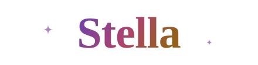

  SCORSTELLA · A SMALL CONSTELLATION

<h1 align="center">
  <picture>
    <source media="(prefers-reduced-motion: reduce) and (prefers-color-scheme: dark)" srcset="assets/stella-name-dark.svg#still">
    <source media="(prefers-reduced-motion: reduce)" srcset="assets/stella-name-light.svg#still">
    <source media="(prefers-color-scheme: dark)" srcset="assets/stella-name-dark.svg">
    
  </picture>
</h1>

  把好奇心写成代码，把微光留在字里行间。 
  Research, code, and a little starlight.

  

 

### 在这里 · Around here

一处留给问题、实验与灵感的小小空间。

- **研究** · 从一个好问题出发，沿着证据慢慢走。
- **代码** · 让想法落地，也让细节经得起推敲。
- **文字** · 理清复杂的事，留下值得再读的句子。

### 文字与札记 · Notes

把一时的想法整理成可以重读的文字。

→ [翻开文字目录](writings/README.md)

### 一点偏爱 · Small things

清楚的逻辑，克制的设计，还有尚未被问出的好问题。

 

  ✦ 
  Stay curious. Leave a little light.

